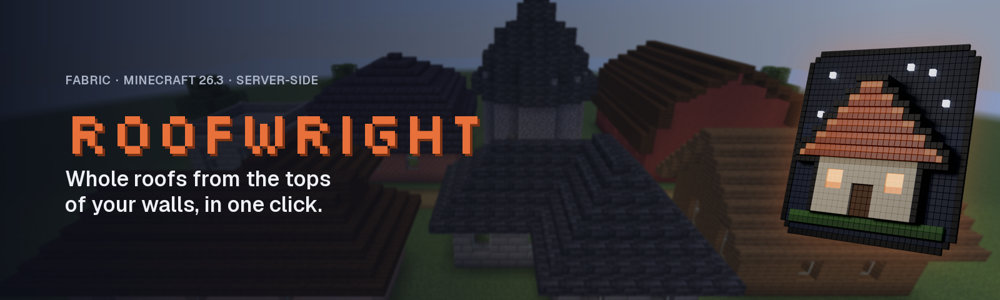
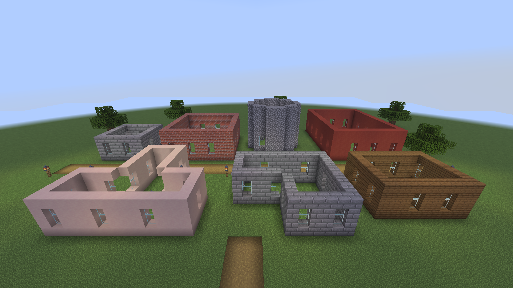
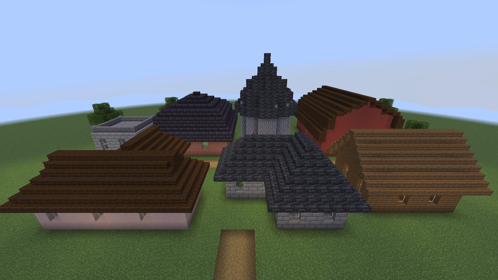
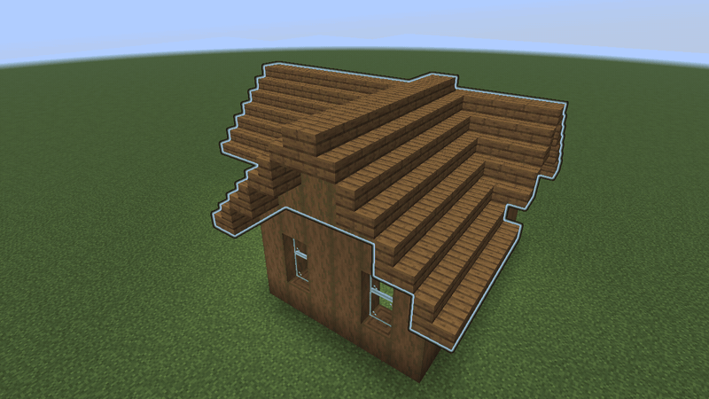
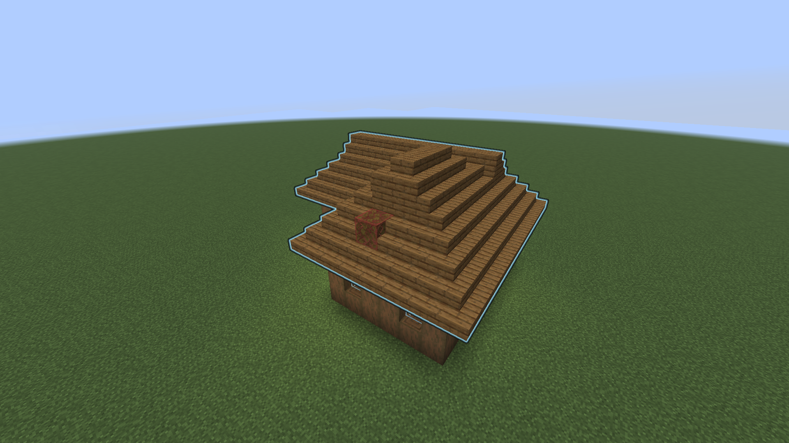
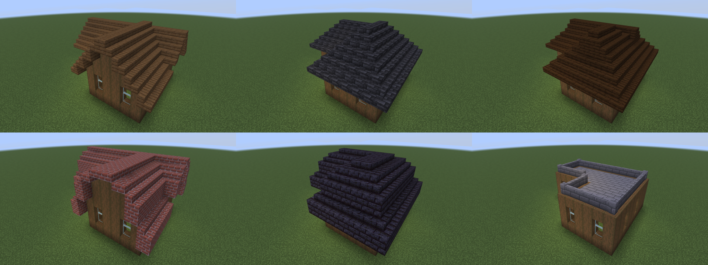
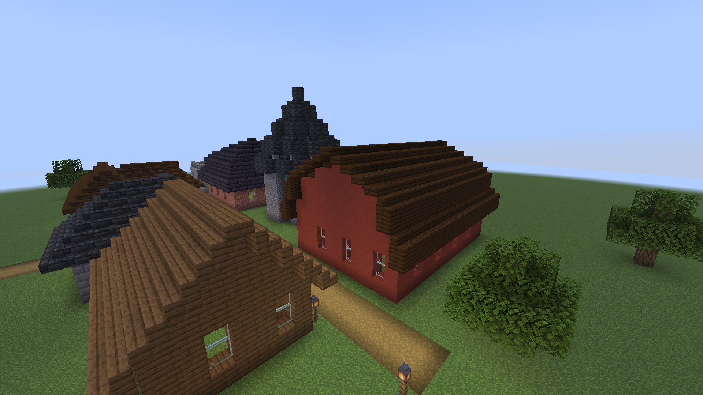
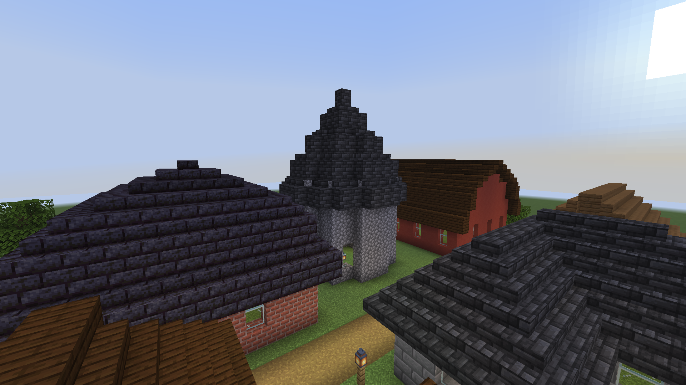
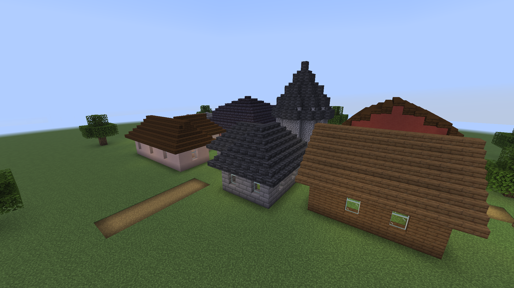
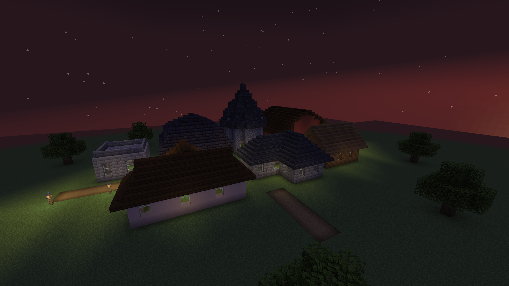

<p align="center">
  
</p>

<p align="center">
  <a href="https://github.com/razekteixeira/roofwright/actions/workflows/build.yml"></a>
  
  
  <a href="LICENSE"></a>
</p>

| Bare walls | One click each |
|---|---|
|  |  |

Roofs are the slow part of every build: hundreds of stairs and slabs, and hips, valleys and corners
that are easy to get wrong. **Roofwright builds the whole roof for you.** Right-click the top of a
wall with the wand: it finds the building's outline, shows you a ghost of the roof, and builds it
when you sneak-click. Undo puts everything back.

- **Finds the outline itself.** One click on a wall top: rectangles, L, T and U shapes and any
  other right-angled outline, no marking corners by hand.
- **Ten styles:** gable, hip, dutch gable, gambrel, mansard, pyramid, shed, flat with a parapet,
  cone and dome. Three pitches (1:2 slabs, 1:1 stairs, 2:1 steep) and an overhang of 0 to 3.
- **Corners done right.** Every stair gets the shape Minecraft itself would give it, so hips have
  outer corners, valleys have inner corners, and nothing changes shape after it is placed.
- **Wings meet properly.** On L and T houses the smaller wing's ridge runs into the main roof and
  ends in a valley; a small bay gets its own little cross gable.
- **Gable walls filled** with the block your walls are made of.
- **Any material:** pick any stairs, slab or block of a family (oak, deepslate tiles, bricks...) or
  stair-like blocks from other mods, such as Macaw's Roofs.
- **Preview first.** A glowing ghost only you can see; blocks in the way show in red.
- **Safe on servers.** Only fills air unless you ask for `force`, never replaces chests or
  bedrock, respects claim mods (Common Protection API), places a few thousand blocks per tick at
  most, and undo and redo leave alone anything someone changed in the meantime.
- **Server-side only.** Players join with an unmodified client; the wand is a vanilla item.



| Ghost preview | Six styles on one house |
|---|---|
|  |  |

| Barn (gambrel) | Tower (cone) | Valleys (hip on an L) | Dusk |
|---|---|---|---|
|  |  |  |  |

Every screenshot here is a real capture from the game client, produced by
[`RoofwrightCaptures`](src/gametest/java/io/github/razekteixeira/roofwright/gametest/client/RoofwrightCaptures.java),
which builds the village and roofs it with the same commands you would type. The 3D logo is
rendered in Blender from the icon's own pixels ([`branding/render_logo3d.py`](branding/render_logo3d.py)).

## How to use it

1. `/roof wand` gives you the Roofwright Wand (a stick that glows).
2. **Right-click the top block of a wall.** The outline is detected and a ghost roof appears.
3. Change anything and the ghost updates: `/roof style hip`, `/roof pitch steep`,
   `/roof overhang 2`, `/roof material deepslate_tiles`. **Left-click** cycles the style,
   sneak + left-click the pitch.
4. **Sneak + right-click** (or `/roof place`) builds it. `/roof undo` takes it back.

## Commands

`/roof` and the alias `/roofwright` are the same command.

| Command | What it does |
|---|---|
| `/roof wand` | Gives you the wand |
| `/roof detect [pos]` | Detects the building whose wall top you look at (or at `pos`) and previews its roof |
| `/roof select <from> <to>` | Selects a rectangle by hand; the wall top is the higher corner |
| `/roof select add <from> <to>` | Adds a rectangle to the selection (build L, T or U shapes by hand) |
| `/roof style <style>` | `gable`, `hip`, `dutch_gable`, `gambrel`, `mansard`, `pyramid`, `shed`, `flat`, `cone`, `dome` |
| `/roof pitch <pitch>` | `low` (1:2, slabs), `normal` (1:1, stairs), `steep` (2:1) |
| `/roof overhang <0-3>` | How far the roof reaches past the walls |
| `/roof ridge auto\|x\|z` | Ridge direction for gable-type roofs (auto follows each wing's long side) |
| `/roof shed north\|east\|south\|west` | The side a shed roof rises towards |
| `/roof ridgecap slab\|full` | Cap single ridges with a slab (default) or a full block |
| `/roof material <block> [<slab> <full>]` | Material from any member of a block family, or three blocks given explicitly |
| `/roof gable match\|<block>` | Gable walls match the clicked wall block (default) or use a block |
| `/roof preview` | Shows the ghost again |
| `/roof place [force]` | Builds the roof; `force` also replaces plain blocks in the way |
| `/roof undo`, `/roof redo` | Takes your last roof back, or puts it back again |
| `/roof cancel` | Stops a roof that is still going up, and clears the preview |
| `/roof info` | Your settings, selection and history |
| `/roof reload` | Re-reads `config/roofwright.json` |

### Permissions

With a permissions mod such as LuckPerms, grant the nodes `roofwright.use` (everything above),
`roofwright.force` (`/roof place force`), `roofwright.unlimited` (bigger than `maxBlocks` and
`maxSpan`) and `roofwright.admin` (`/roof reload`). Without one, the vanilla operator levels from
the config apply: use 2, force 2, unlimited 3, admin 3. Holding a wand grants nothing; every click
checks `roofwright.use`.

### Configuration

`config/roofwright.json` is created on first start with every option:

```json
{
  "maxSpan": 96,
  "maxBlocks": 30000,
  "blocksPerTick": 2000,
  "millisPerTick": 5,
  "historySize": 10,
  "previewLimit": 3000,
  "previewSeconds": 300,
  "permissionLevels": { "use": 2, "force": 2, "unlimited": 3, "admin": 3 }
}
```

Out-of-range values are clamped with a warning in the log. A file that cannot be read is reported
and left untouched; the previous settings stay active. Roofs bigger than `previewLimit` preview
their top surface only.

## How it works

- **Outline:** from the clicked block, every solid block in the same layer that touches it (corners
  included) is a wall; everything inside the walls that the outside cannot reach is the building.
  Courtyards are roofed over.
- **Hip-type roofs** (hip, pyramid, mansard) use the chessboard distance to the outside. On
  right-angled outlines this is the same as the straight skeleton carpenters' roofs follow, so hips
  and valleys fall on the diagonals.
- **Gable-type roofs** (gable, dutch gable, gambrel) split the outline into rectangles, largest
  first. The largest is the main wing; every smaller piece attached to it gets a ridge that runs
  into the main roof and ends at its ridge line.
- **Cone and dome** use the straight-line distance, so round towers stay round.
- A profile turns the distance into a height in half blocks; each column is filled from its lowest
  neighbour up, with a stair, slab or full block on top, and every stair gets the corner shape
  Minecraft's own rule would give it. The tests check that every roof is watertight.

The research behind the design, with sources, is in [docs/research.md](docs/research.md).

## Safety

- Places only into **air**. Tall grass, water and everything else count as in the way and are
  skipped (red in the preview), unless you use `force`, which still never replaces block entities
  (chests, signs, spawners) or unbreakable blocks.
- Respects claims from mods that implement the
  [Common Protection API](https://github.com/Patbox/common-protection-api) (GOML, Flan and others),
  vanilla spawn protection, adventure mode, the world border and build height. Claims are still
  checked if you log off while your roof is going up.
- **Limits:** `maxBlocks` per roof, `maxSpan` per outline, and a per-tick budget of
  `blocksPerTick` blocks and `millisPerTick` milliseconds shared by everyone's roofs.
- **Undo and redo** restore only blocks that are still exactly as the roof left them.
- History and previews live in memory; a server restart clears them.

## Performance

Measured on an Apple M-series Mac, warmed up, repeated readings:

- **Planning** ([`./gradlew benchmark`](src/test/java/io/github/razekteixeira/roofwright/core/PlannerBenchmark.java)):
  a 64 x 64 hip roof takes a median 1.1 ms, 128 x 128 takes 3.8 ms, and 256 x 256 (66,564 blocks)
  takes 16.8 ms.
- **Placing** ([`tools/benchmark.sh`](tools/benchmark.sh), dev server over RCON): a 16,900-block hip
  roof goes up in 9 ticks with the default budget; the worst tick of each run has a median of
  2.05 ms (max 2.16 ms over 5 runs).

## Install

Roofwright needs Minecraft **26.3**, [Fabric Loader](https://fabricmc.net/use/) 0.19.5 or newer,
[Fabric API](https://www.curseforge.com/minecraft/mc-mods/fabric-api) and Java 25.

- **Server:** put the Roofwright jar and Fabric API in the server's `mods/` folder.
- **Singleplayer:** install Fabric Loader for 26.3 with your launcher, then put both jars in `.minecraft/mods`.

## Building and contributing

```bash
./gradlew build              # compile, unit tests, GameTests on a headless server
./gradlew benchmark          # planner benchmark
./gradlew runServer          # dev server in ./run, no Minecraft account needed
./gradlew runClientGameTest  # real client: regenerates the screenshots (opens a window)
```

JDK 25 is required. See [CONTRIBUTING.md](CONTRIBUTING.md) for the layout, the testing rules, the
artwork pipeline and how releases work.

## License

Apache License 2.0, see [LICENSE](LICENSE). Bundled third-party code is listed in
[THIRD_PARTY_NOTICES.md](THIRD_PARTY_NOTICES.md).

NOT AN OFFICIAL MINECRAFT PRODUCT. NOT APPROVED BY OR ASSOCIATED WITH MOJANG OR MICROSOFT.
